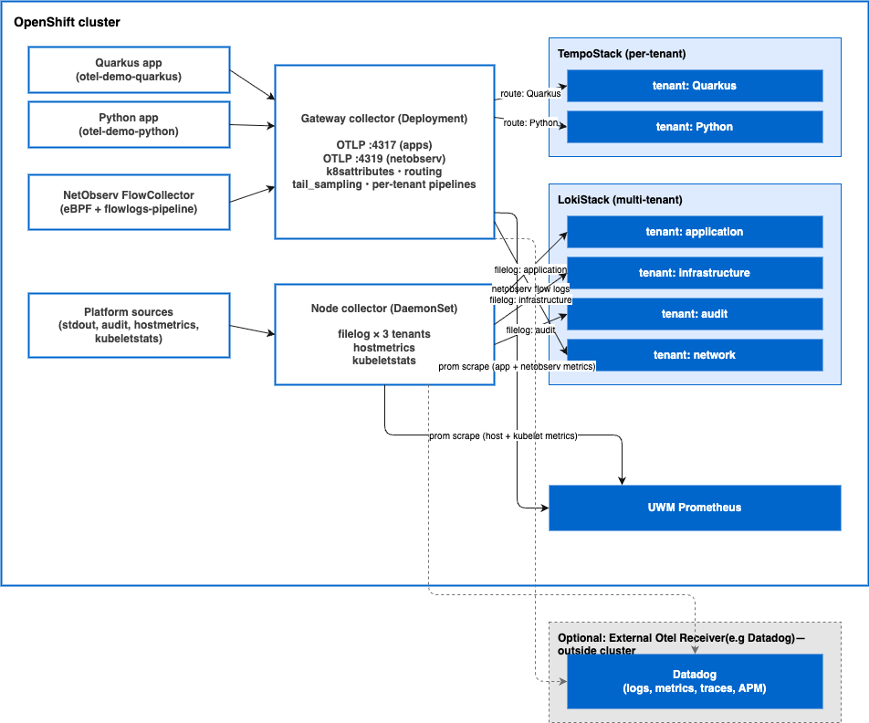
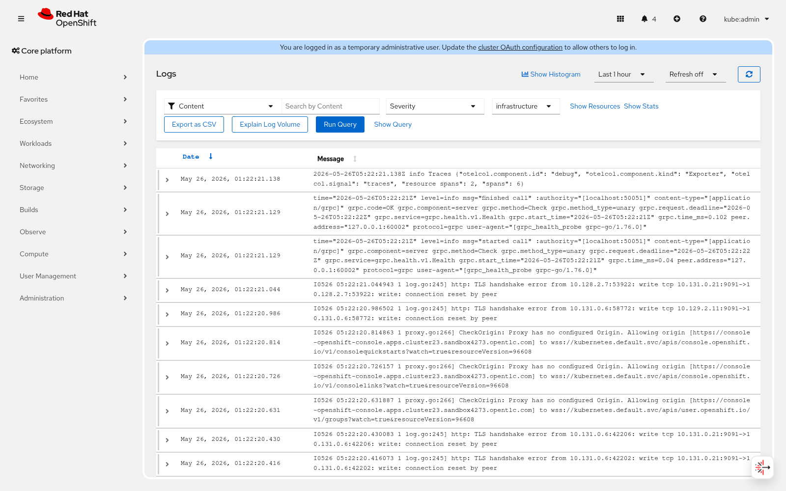
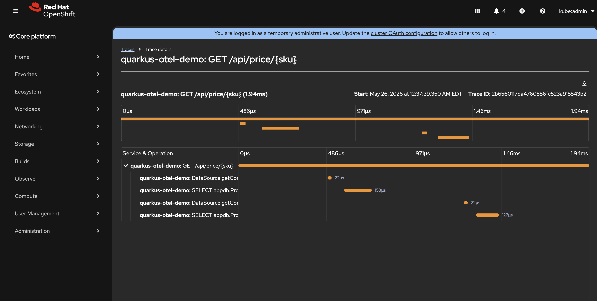
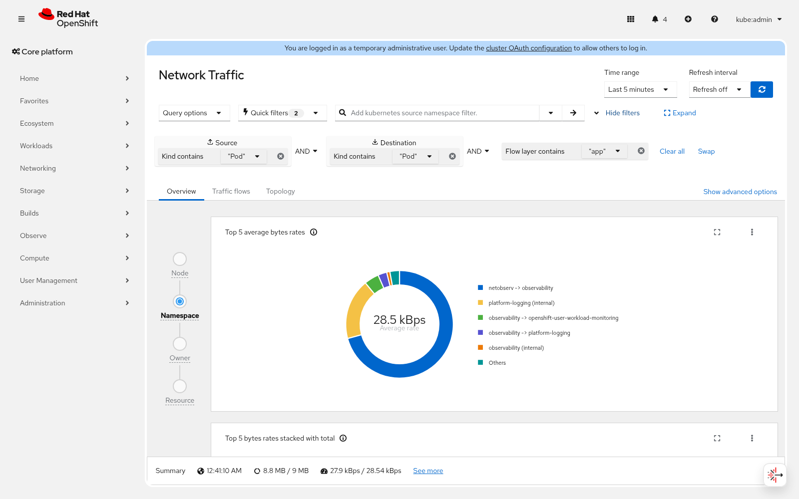
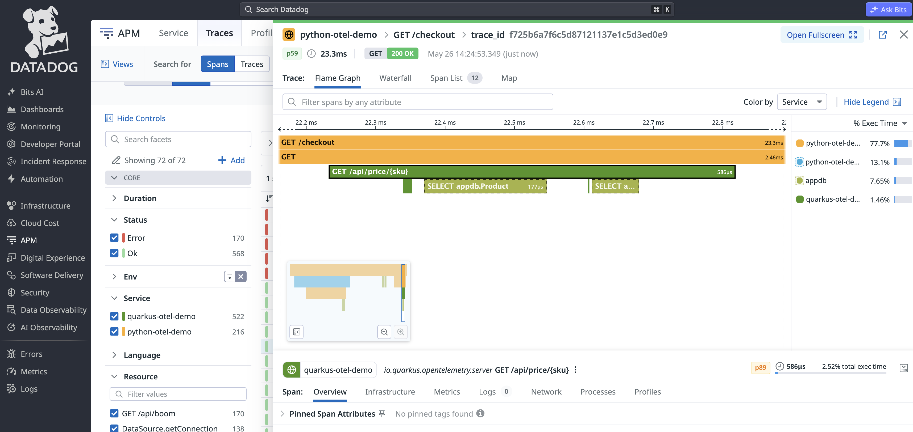
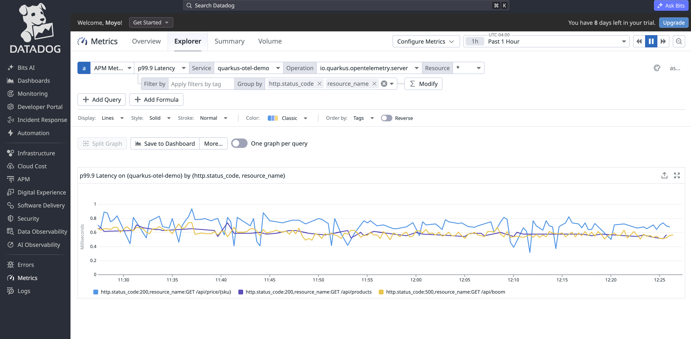
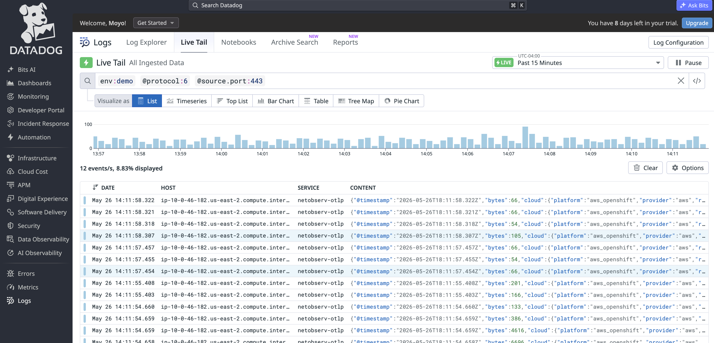

# One collection layer, four signal types, and a Datadog fan-out to prove it

OpenTelemetry has become the default vendor-neutral standard for
collecting telemetry. It's CNCF-graduated, supported by every major
observability backend, and now ships as part of OpenShift via the Red
Hat build of OpenTelemetry. One collector binary, one configuration
model, and one set of resource-attribute conventions cover logs,
metrics, traces, and (newly) network flows.

OpenShift already provides a strong native observability stack: Tempo
for traces, User Workload Monitoring for metrics, LokiStack for logs,
and the Network Observability Operator for flows. The Red Hat build of
OpenTelemetry adds a single, standardized collection layer that sits
between the cluster's signal sources and those destinations. Once that
layer is in place, the same collectors can additively fan the data out
to any OTel-compatible backend without touching the source side at
all.

This post is a how-to for wiring all three signal categories into the
Red Hat build of OpenTelemetry on OpenShift:

1. **Platform signals:** container logs, audit logs, node host
   metrics, and kubelet stats via a privileged DaemonSet collector.
2. **Application signals:** auto-instrumented Python and a
   `quarkus-opentelemetry`-instrumented Quarkus app, both shipping
   OTLP to a gateway Deployment collector.
3. **Network Observability signals:** eBPF-captured flow records and
   aggregated flow metrics from the NetObserv FlowCollector's new
   first-class OTel exporter.

The whole reference cluster lives at
[github.com/MoOyeg/app-oltp-openshift](https://github.com/MoOyeg/app-oltp-openshift.git)
(Ansible) so you can reproduce it. At the end we show how the same two
collectors fan everything out to Datadog with a single flag flip, as
an extra example of why the OTel-as-the-seam pattern earns its keep.

## The architecture



Two collectors do all the work. A node-local DaemonSet handles
host-only collection (file tailing, audit logs, hostmetrics,
kubeletstats). A gateway Deployment handles everything that arrives
over OTLP (application spans, application metrics, NetObserv flow
records, and flow metrics). Each signal lands in its native OpenShift
destination, and the same collectors can additionally export a copy
off-cluster.

## 1. Platform signals: a privileged DaemonSet collector

The node-local DaemonSet does the things only a host-network pod can
do: tail `/var/log/pods/**` for container logs, tail
`/var/log/audit/audit.log` and the various API server audit files for
audit logs, scrape kubelet stats, and produce `hostmetrics`. Each log
stream gets its own `filelog` receiver and its own pipeline so it can
be routed into the right LokiStack tenant (`application`,
`infrastructure`, or `audit`) via the OTLP-HTTP exporter against the
LokiStack gateway.

`hostmetrics` and `kubeletstats` feed an admin-only `ServiceMonitor`
so node-level series stay out of the Dev-facing UWM views.

Log collection on this cluster comes down to three options. Option
one: the OTel DaemonSet tails `/var/log/pods/**` itself and ships
straight to LokiStack via OTLP-HTTP. Option two: leave the OpenShift
Logging Operator's Vector collector in place and let it own the log
pipeline, with the OTel DaemonSet handling only audit, hostmetrics,
and kubeletstats. Option three: run both collectors against the same
files and accept duplicate ingestion, doubled storage, and racing
file offsets. Recommend that you **don't run two collectors against the same
source files**, so option three is out. This example uses option one, which
makes the OTel DaemonSet the only log shipper on this cluster.



The OpenShift console's Logs view, reading from the
`openshift-logging` LokiStack the DaemonSet's `filelog/infrastructure`
pipeline writes into. The same pattern populates the `application` and
`audit` tenants from their respective pipelines.

## 2. Application signals: auto-inject for Python, manual SDK for Quarkus

The gateway collector listens on OTLP/gRPC (4317) and OTLP/HTTP
(4318). To show both ends of the instrumentation spectrum and to prove out
per-tenant isolation, we deployed two example apps into two separate
namespaces: a Python service in `otel-demo-python` and a Quarkus
service in `otel-demo-quarkus`. Both ship spans to the same gateway,
but each one reaches OTel a different way. The Python app uses
**auto-instrumentation**: an `Instrumentation` CR tells the
OpenTelemetry Operator's mutating webhook to inject the OTel SDK
init container into matching pods, so the application code itself
stays untouched. The Quarkus app uses **build-time
instrumentation** via the `quarkus-opentelemetry` extension, which
is the recommended path for Quarkus because pairing the Quarkus
runtime with the Java agent is not supported. Once the spans arrive
at the gateway, the `routing` processor uses `service.namespace` to
fan each app's traffic into its own pipeline and its own TempoStack
tenant, so the Quarkus team and the Python team get fully isolated
trace stores and RBAC even though they share one collector.

At the gateway, three things happen to every span:

1. **`k8sattributes`** resolves `k8s.namespace.name`, `k8s.pod.name`,
   `k8s.deployment.name`, etc. from the sender's pod IP.
2. **`resource`** stamps the static dimension
   `deployment.environment.name=demo` so every signal carries the same
   environment tag.
3. **`routing`** sends each tenant's spans into its own pipeline by
   matching `service.namespace` against the configured Tempo tenant.

Each per-tenant pipeline then runs `tail_sampling` (keep every error,
keep every slow trace, probabilistically sample the rest) and exports
via OTLP to its own TempoStack tenant. Per-user RBAC at the Tempo
gateway means the Quarkus team only ever sees Quarkus traces.

The wiring that produces that isolation is small. One ingress pipeline
enriches every span, one `routing` connector picks the destination
from `service.namespace`, and one tenant-specific OTLP exporter stamps
the `X-Scope-OrgID` header Tempo's multitenant gateway uses to pick
the tenant:

```yaml
connectors:
  routing:
    default_pipelines: [traces/quarkus]
    table:
      - context: resource
        condition: attributes["service.namespace"] == "otel-demo-quarkus"
        pipelines: [traces/quarkus]
      - context: resource
        condition: attributes["service.namespace"] == "otel-demo-python"
        pipelines: [traces/python]

exporters:
  otlp/quarkus:
    endpoint: "tempo-demo-gateway.observability.svc:8090"
    auth: { authenticator: bearertokenauth }
    headers: { X-Scope-OrgID: quarkus }
  otlp/python:
    endpoint: "tempo-demo-gateway.observability.svc:8090"
    auth: { authenticator: bearertokenauth }
    headers: { X-Scope-OrgID: python }

service:
  pipelines:
    traces/in:
      receivers: [otlp]
      processors: [k8sattributes, resource]
      exporters: [routing]
    traces/quarkus:
      receivers: [routing]
      processors: [tail_sampling, batch]
      exporters: [otlp/quarkus]
    traces/python:
      receivers: [routing]
      processors: [tail_sampling, batch]
      exporters: [otlp/python]
```

Adding a third tenant is three more blocks: one `routing` table entry,
one `otlp/<tenant>` exporter, one `traces/<tenant>` pipeline.



A single `GET /api/price/{sku}` trace from the Quarkus demo, expanded
in the OpenShift Tracing UI against the Quarkus TempoStack tenant.
`quarkus-opentelemetry` produced the HTTP span and the JDBC
`DataSource.getConnection` and `SELECT appdb.Pro...` child spans.

App metrics flow through the same gateway. The collector exposes a
Prometheus endpoint on port 8889, and a `ServiceMonitor` points User
Workload Monitoring at it.

## 3. Network Observability signals: NetObserv's first-class OTel exporter

OpenShift's Network Observability Operator runs eBPF agents on every
node and processes the captured flow records through a pod called
`flowlogs-pipeline`. By default it writes enriched flow records to a
network-tenant LokiStack and emits aggregated flow metrics to
in-cluster Prometheus.



The OpenShift console's Network Traffic view, reading from the
`network` LokiStack tenant `flowlogs-pipeline` writes. This is the
in-cluster destination NetObserv ships to by default; the OTel
exporter below is purely additive.

The `FlowCollector` CRD recently gained a first-class
`spec.exporters[].type: OpenTelemetry` entry. That single block turns
NetObserv into a third OTel source on the same gateway collector:

```yaml
spec:
  exporters:
    - type: OpenTelemetry
      openTelemetry:
        targetHost: gateway-collector.observability.svc.cluster.local
        targetPort: 4319
        protocol: grpc
        logs:
          enable: true
        metrics:
          enable: true
```

`flowlogs-pipeline` then OTLP-encodes each enriched flow as **two**
signals: one OTLP log record per flow (with attributes like
`source.address`, `destination.k8s.namespace.name`, `bytes`,
`tcp.flags`, `dns.latency`, etc.), and a set of OTLP metric counters
(`netobserv_namespace_flows_total`, `netobserv_workload_*_bytes_total`,
`netobserv_namespace_dns_latency_seconds`, and so on).

A few sharp edges to know about:

- **Use a dedicated receiver port.** Point NetObserv at the existing
  OTLP receiver on 4317 and the flow metrics land on the same metrics
  pipeline as your app metrics, end up on the UWM ServiceMonitor, and
  duplicate series across your dashboards. Add a separate
  `otlp/netobserv` receiver on 4319 with its own isolated
  `logs/netobserv` and `metrics/netobserv` pipelines:

  ```yaml
  receivers:
    otlp/netobserv:
      protocols:
        grpc:
          endpoint: 0.0.0.0:4319

  service:
    pipelines:
      logs/netobserv:
        receivers: [otlp/netobserv]
        processors: [memory_limiter, resource, batch]
        exporters: [datadog]
      metrics/netobserv:
        receivers: [otlp/netobserv]
        processors: [memory_limiter, resource, batch]
        exporters: [datadog]
  ```

  Two receiver instances on two ports, two pipeline trees, zero
  crosstalk: the app `metrics` pipeline still feeds UWM, and the
  netobserv pipelines only fan out where you want them to.

- **The auto-generated NetworkPolicy blocks the new egress.**
  NetObserv manages its own NetworkPolicy by default and locks egress
  from `flowlogs-pipeline` to `openshift-{dns,monitoring,*-apiserver}`
  plus same-namespace. The cross-namespace dial to the OTel gateway in
  the `observability` namespace then times out silently for hours. Fix
  it with one line on the FlowCollector:

  ```yaml
  spec:
    networkPolicy:
      enable: true
      additionalNamespaces:
        - observability
  ```

  We learned this the hard way. Every metric on the receiver side
  said "0 accepted" until we patched the NP.

- **Sampling is your cost knob.** `spec.agent.ebpf.sampling: 50`
  captures every 50th flow. That's fine for in-cluster Loki, but
  fanning out one event per captured flow downstream turns even 1/50
  on a busy cluster into meaningful volume. Tune `sampling` up, or set
  `openTelemetry.logs.enable: false` to send only the aggregated
  metrics.

## What you have at this point

With the three sources wired up, every signal lands in its native
OpenShift home:

| Source | Signal | Lands in |
|---|---|---|
| DaemonSet | Container / infra / audit logs | LokiStack (`openshift-logging` tenants) |
| DaemonSet | Host + kubelet metrics | UWM (admin-scoped ServiceMonitor) |
| Application SDKs | Spans | TempoStack (per-tenant) |
| Application SDKs | Metrics | UWM (`app.*`, `http.server.*`) |
| NetObserv | Flow records | LokiStack (`network` tenant) |
| NetObserv | Flow metrics | In-cluster Prometheus (`netobserv_*`) |

Three sources, two collectors, six destinations, and one configuration
model.

## Bonus: an extra test, fanning everything out to Datadog

OTel's real payoff is that "where the data goes" is just another
exporter in the pipeline. With three signal sources already feeding
the same two collectors, adding a second destination is small wiring.
We added a Datadog fan-out as an extra test of that property; the same
pattern works for any OTel-compatible backend.

One catch first. The `datadog` exporter, the `datadog/connector`, and
`resourcedetection` with the `openshift` detector aren't in the Red
Hat build's curated component set, so the Datadog fan-out swaps to the
upstream `opentelemetry-collector-contrib` image. Our Ansible role
gates that swap on `datadog_enabled=true`. Flip the flag off and both
collectors revert to the Red Hat image, and the contrib-only blocks in
the Jinja templates drop out cleanly.

The wiring itself is a handful of lines:

```yaml
exporters:
  datadog:
    api:
      site: us5.datadoghq.com
      key: ${env:DD_API_KEY}

connectors:
  datadog/connector: {}
```

The `datadog/connector` is the non-obvious piece. It receives spans
and emits *APM trace metrics* (per-service request, error, and latency
histograms) that power Datadog's APM Service Catalog. Wire it onto
every `traces/*` pipeline as an exporter, and onto the `metrics`
pipeline as a receiver. Without it, the catalog's RED stats go missing
or get back-computed lossily.

The API key never goes into source: the Ansible role reads
`DATADOG_API_KEY` from the operator's runtime environment into a
`datadog-api-key` Secret, and both collectors mount it as
`DD_API_KEY`.

Once the flag is on, the same six signals from the table above
continue flowing to their native homes *and* show up in Datadog (logs
in Live Tail, metrics in Metrics Explorer, traces and RED stats in
APM).



The same span that lit up the OpenShift Tracing UI earlier, rendered
in Datadog APM. The trace ID is the same on both sides; the
`datadog/connector` produced the per-service RED stats that populate
APM Service Catalog from those spans.



p99.9 latency for the Quarkus service in Datadog's Metrics Explorer,
broken down by `http.status_code` and `resource_name`. These are the
APM trace metrics the `datadog/connector` derives from incoming spans:
no separate metrics SDK, no extra scrape config, just the same span
stream the OpenShift Tracing UI is reading from. Per-route latency
histograms like this fall out of the connector for free, so the same
data backs both the in-cluster TempoStack and Datadog's APM dashboards.



NetObserv flow records in Datadog Live Tail, after the
`flowlogs-pipeline` OTel exporter, the dedicated `otlp/netobserv`
gateway receiver, and the `logs/netobserv` → `datadog` pipeline path.
Records carry the OTel-semantic attribute names (`source.address`,
`destination.address`, `bytes`, `tcp.flags`, `protocol`) produced by
flowlogs-pipeline's `replace_keys` transform.

See [`docs/datadog.md`](../datadog.md) for the per-pipeline wiring,
verification metrics, and cost knobs.

---

*Reference implementation:*
[github.com/MoOyeg/app-oltp-openshift](https://github.com/MoOyeg/app-oltp-openshift.git)
ships example Ansible roles for every component above, including the NetObserv
OpenTelemetry exporter, the dedicated `otlp/netobserv` receiver, and
the optional Datadog fan-out gated on `datadog_enabled` and
`netobserv_datadog_enabled`. [`docs/datadog.md`](../datadog.md) covers
the verification steps, the NetworkPolicy gotcha, and the cost knobs
in more detail.
